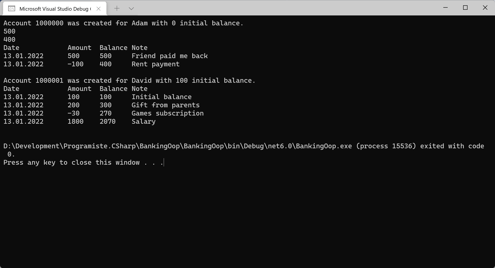

# Bankovní účet (třídy)

Procvičíme si základní práci s třídami (`class`) - jejich definicí a použitím.

Definujte objektový model (třídy), který bude reprezentovat základní bankovnictví:
* Bankovní účet má vlastníka (jméno) a počáteční vklad (částku).
* Bankovní účet má číslo účtu, které je mu automaticky přiděleno při založení.
* Změny zůstatku bankovního účtu provádíme prostřednictvím transakcí na něm. Každý účet si pamatuje seznam transakcí, které se s ním prováděly.
  * Každá transakce má datum, popis a částku (kladnou/zápornou).
* Bankovní účet podporuje několik operací
  * Vklad na účet - Musí být kladný, vytvoří transakci zvyšující zůstatek.
  * Výběr z účtu - Musí být kladný, vytvoří transakci snižující zůstatek. Nelze provést, pokud zůstatek účtu nepostačuje na požadovanou částku.
  * Počáteční vklad - Vzniká při založení účtu a je v podstatě první transakcí na účtu.
  * Výpis z účtu - Vrátí textovou reprezentaci seznamu všech transakcí s účtem.

*Poznámka: Model bankovnictvím je zde pro výukové účely značně zjednodušen. Ve skutečném bankovnictvím má například každá transakce dvě strany - dva účty, mezi kterými se transakce provádí.*

## Challenges (volitelná rozšíření zadání)
1. Reprezentujte transakce jako operace mezi dvěma účty.
2. Přidejte podporu převodu peněz mezi dvěma účty. Hlídejte podmínky, které musí účty splňovat, aby bylo možné transakci provést.
3. Přidejte podporu termínovaných spořících účtů. Takový účet nedovolí provádět transakce mimo zvolené periodické datum - např. jen v jeden konkrétní den v týdnu (týdenní fixace), nebo měsíci (měsíční fixace).
4. Přidejte podporu úročení účtů. Na každém účtu bude evidována úroková sazba a nějakou centrální úlohu spouštěnou jednou měsíčně připište na účty získané úroky.

## Inspirace

Obdobnou úlohu s podrobným popisem řešení a zdrojovými kódy najdete v souvisejícím kurzu:
https://docs.microsoft.com/cs-cz/dotnet/csharp/fundamentals/tutorials/classes