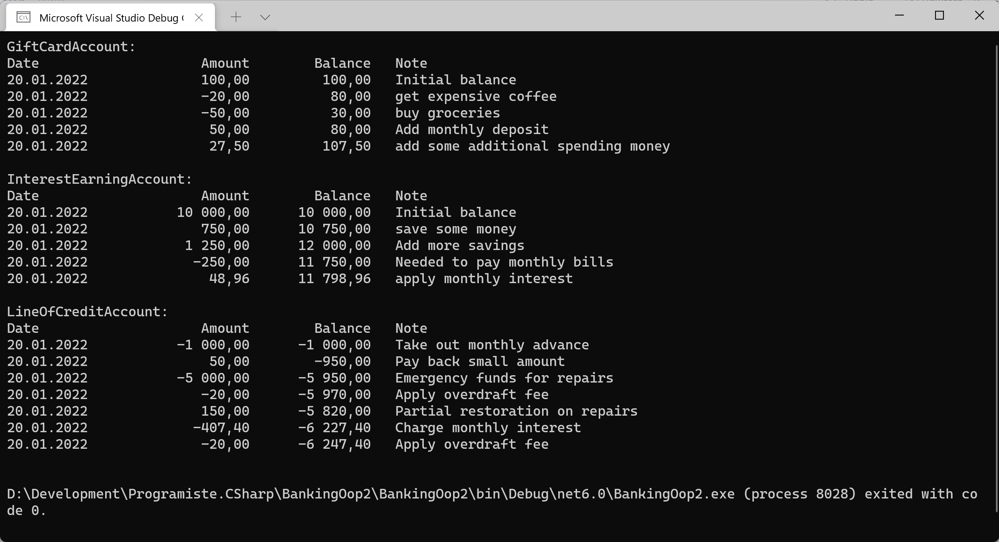

# Bankovní účty II. (OOP základy)

Navazujeme na předchozí cvičení [Bankovní účet](https://github.com/hakenr/Programiste.CSharp/tree/master/BankingOop#readme), na kterém jsme si ukazovali třídy a jejich základní členy (properties, methods, fields, constructor).
Nyní rozšíříme model bankovnictví o různé typy účtů a podíváme se na základní aspekty *objektově orientovaného programování (OOP)*:

* abstrakci,
* zapouzdření,
* dědičnost,
* polymorfizmus.

Úloha se překrývá s Microsoft tutorialem OOP: 
* https://docs.microsoft.com/en-us/dotnet/csharp/fundamentals/tutorials/oop - anglicky
* https://docs.microsoft.com/cs-cz/dotnet/csharp/fundamentals/tutorials/oop

## Výchozí stav
Budeme pokračovat se zdrojovými kódy z minulého cvičení - třídy `BankAccount` a `Transaction`. Pokud je nemáte k dispozici, použijte jako základ [tento kód](https://github.com/hakenr/Programiste.CSharp/blob/master/BankingOop/BankingOop/Program.cs), který si zkopírujte do nového projektu.

## Úkol
Úkolem je zavést do modelu bankovnictví nové typy účtů:
* `InterestEarningAccount` - "Spořící účet" - Na konci každého měsíce získá vkladatel úroky.
* `LineOfCreditAccount` - "Úvěrový účet" - Může mít záporný zůstatek, z kterého se platí měsíční úroky. Transakce do záporu jsou zpoplatněny.
* `GiftCardAccount` - "Předplacený účet dárkového poukazu" - Začíná s určitým vkladem a lze ho jenom čerpat. Jednou za měsíc (na začátku) může být znovu nabit.

## `InterestEarningAccount` - "Spořící účet"
* Na konci každého měsíce získá úrok 2% ze zůstatku.
* Jinak se chová jako běžný účet.

## `LineOfCreditAccount` - "Úvěrový účet"
* Může mít záporný zůstatek, ale neměl by být větší než na začátku přidělený limit - výši úvěru (`creditLimit`).
* Na konci každého měsíce, pokud je zůstatek menší než 0, je nutné zaplatit úrok z úvěru (v procentech ze zůstatku).
* Pokud výjimečně dojde k přečerpání přiděleného úvěrového limitu, je nutné zaplatit mimořádný poplatek `$20`.

## `GiftCardAccount` - "Předplacený účet dárkového poukazu"
* Na konci každého měsíce se automaticky připíše nový měsíční vklad v předem dané výši, něco jako pravidelné kapesné.

*Poznámka: Model bankovnictvím je zde pro výukové účely značně zjednodušen. Ve skutečném bankovnictvím má například každá transakce dvě strany - dva účty, mezi kterými se transakce provádí.*

## Challenges (volitelná rozšíření zadání)
1. U spořícího účtu implementujte úrokovou tabulku. Pokud je zůstatek menší než X, neúročí se, zůstatek v rozmezí Y..Z se úročí sazbou A, zůstatek vetší než Z se úroční nízkou sazbou B.
2. U spořícího účtu implementujte "termínovost" - dovolte výběry pouze v určité periodě - např. jen v první den v měsíci.
3. U úvěrového účtu implementujte vyšší úrokovou sazbu za čerpání přes limit.
4. U předplaceného účtu dárkového poukazu implementujte počet období, po které se bude automaticky obnovovat, potom skončí.
5. Přidejte na všechny účty poplatky dle vlastního uvážení - pravidelný poplatek za vedení účtu, poplatek za každou transakci, atp.
5. Implementujte model samostatného transakčního deníku, kdy každá transakce bude mít dvě strany - `From` a `To`. Vytvořte účet pro banku, z kterého bude banka klientům připisovat úroky a naopak na něj bude dostávat bankovní poplatky.

## Inspirace

Kromě Microsoft dokumentace najdete možné řešení i zde (třídy jsou v samostatných souborech):
https://github.com/hakenr/Programiste.CSharp/tree/master/BankingOop2/BankingOop2