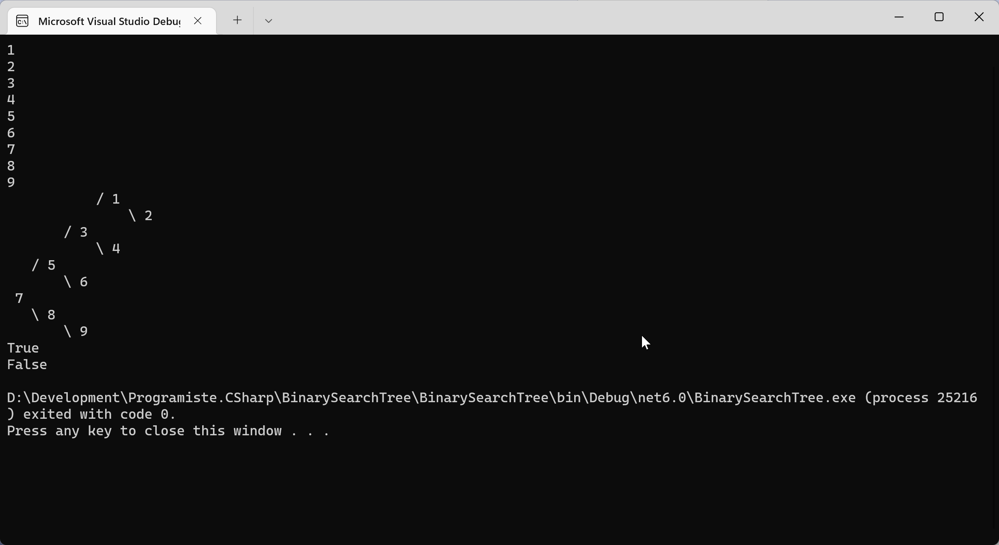

# Binární vyhledávací strom (Binary Search Tree, BST)

[Binární vyhledávací strom](https://cs.wikipedia.org/wiki/Bin%C3%A1rn%C3%AD_vyhled%C3%A1vac%C3%AD_strom) je datová struktura, která:
* je složená z uzlů (Node),
* každý uzel může mít dva potomky (pravého a levého),
* uzle jsou uspořádány podle své hodnoty (klíče)
    * levý podstrom uzlu obsahuje pouze hodnoty (klíče) menší (nebo shodné) než je hodnota (klíč) tohoto uzlu,
    * pravý podstraom uzlu obsahuje pouze hodnoty (klíče) větší (nebo shodné) než je hodnota (klíč) tohoto uzlu,

## Úloha
Naprogramujte vlastní BST, který bude umět minimálně následující operace:
1. `Insert(int value)` - vložení nového prvku,
1. `bool Contains(int value)` - ověření existence prvku,
1. `List<int> GetValues()` - výpis všech hodnot ve stromu (vyzkoušejte si různé podoby navštěvování uzlů - pre-order, in-order, post-order)



### Challenges
Naučte svůj strom další operace:
1. `Print()` - vykreslení stromu na obrazovku v jakkoliv srozumitelné podobě
1. `Delete(int value)` - odebrání prvku ze stromu,
1. `Invert()` - převrátí pořadí prvků ve stromu

Pokuste se implementovat nějakou formu vyvažování stromu (viz např. [AVL stromy](https://cs.wikipedia.org/wiki/AVL-strom).

## Inspirace
```csharp
var tree = new BinarySearchTree();
tree.Insert(7);
tree.Insert(5);
tree.Insert(6);
tree.Insert(3);
tree.Insert(4);
tree.Insert(1);
tree.Insert(2);
tree.Insert(8);
tree.Insert(9);

foreach (var value in tree.GetValues())
{
	Console.WriteLine(value);
}
tree.Print();

Console.WriteLine(tree.Contains(2));
Console.WriteLine(tree.Contains(23));

public class Node
{
	public Node(int value)
	{
		this.Value = value;
	}

	public int Value { get; set; }
	public Node Left { get; set; }
	public Node Right { get; set; }
}

public class BinarySearchTree
{
	public Node Root { get; set; }

	public void Insert(int value)
	{
		Insert(value, Root);
	}
	private void Insert(int value, Node node)
	{
		if (node == null)
		{
			Root = new Node(value);
			return;
		}
		if (value < node.Value)
		{
			if (node.Left == null)
			{
				node.Left = new Node(value);
			}
			else
			{
				Insert(value, node.Left);
			}
		}
		else
		{
			if (node.Right == null)
			{
				node.Right = new Node(value);
			}
			else
			{
				Insert(value, node.Right);
			}
		}
	}

	public bool Contains(int value)
	{
		return Contains(value, Root);
	}
	private bool Contains(int value, Node node)
	{
		if (node == null)
		{
			return false;
		}
		if (value == node.Value)
		{
			return true;
		}
		if (value < node.Value)
		{
			return Contains(value, node.Left);
		}
		else
		{
			return Contains(value, node.Right);
		}
	}

	public List<int> GetValues()
	{
		return GetValues(Root);
	}
	private List<int> GetValues(Node node)
	{
		if (node == null)
		{
			return new List<int>();
		}
		var values = new List<int>();
		values.AddRange(GetValues(node.Left));
		values.Add(node.Value);
		values.AddRange(GetValues(node.Right));
		return values;
	}

	public void Print()
	{
		Print(Root, 0, String.Empty);
	}
	private void Print(Node node, int level, string direction)
	{
		if (node == null)
		{
			return;
		}
		Print(node.Left, level + 1, "/");
		Console.WriteLine(direction.PadLeft(level * 4) + " " + node.Value.ToString().PadRight(4));
		Print(node.Right, level + 1, "\\");
	}
}
```