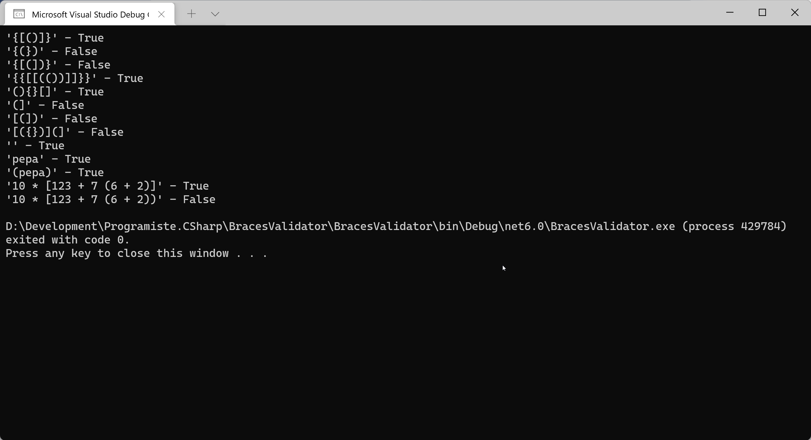

# Validace závorek (BracesValidator)

Napište funkci/třídu, která bude kontrolovat ve vstupním textovém řetězci správné závorkování:
* jako závorky berme `()`, `[]` a `{}`,
* každá otevírací závorka musí mít svou protější zavírací závorku,
* závorky se nesmí křížit.



## Tip
Prozkoumejte datové struktury využívající princip LIFO (Last-In First-Out). Najděte v .NET vhodnou připravenou třídu, která vám při implementaci úlohy pomůže.

## Challenges
* Omezte se na implementaci, která nepoužívá žádné pokročilejší datové struktury než je prosté pole.

## Inspirace
```csharp
Test("{[()]}", true);
Test("{(})", false);
Test("{[(])}", false);
Test("{{[[(())]]}}", true);
Test("(){}[]", true);
Test("(]", false);
Test("[(])", false);
Test("[({})](]", false);
Test("", true);
Test("pepa", true);
Test("(pepa)", true);
Test("10 * [123 + 7 (6 + 2)]", true);
Test("10 * [123 + 7 (6 + 2))", false);

void Test(string input, bool expected)
{
	var actual = BracesValidator.IsValid(input);
	Console.WriteLine($"'{input}' - {actual} {(actual == expected ? String.Empty : "TEST FAILED")}");
}

public class BracesValidator
{
	public static bool IsValid(string braces)
	{
		var stack = new Stack<char>();
		foreach (var c in braces)
		{
			if (c == '(' || c == '{' || c == '[')
			{
				stack.Push(c);
			}
			else if (c == ')' || c == '}' || c == ']')
			{
				if (stack.Count == 0)
				{
					return false;
				}
				var top = stack.Pop();
				if (c == ')' && top != '(')
				{
					return false;
				}
				if (c == '}' && top != '{')
				{
					return false;
				}
				if (c == ']' && top != '[')
				{
					return false;
				}
			}
		}
		return stack.Count == 0;
	}
}
```

