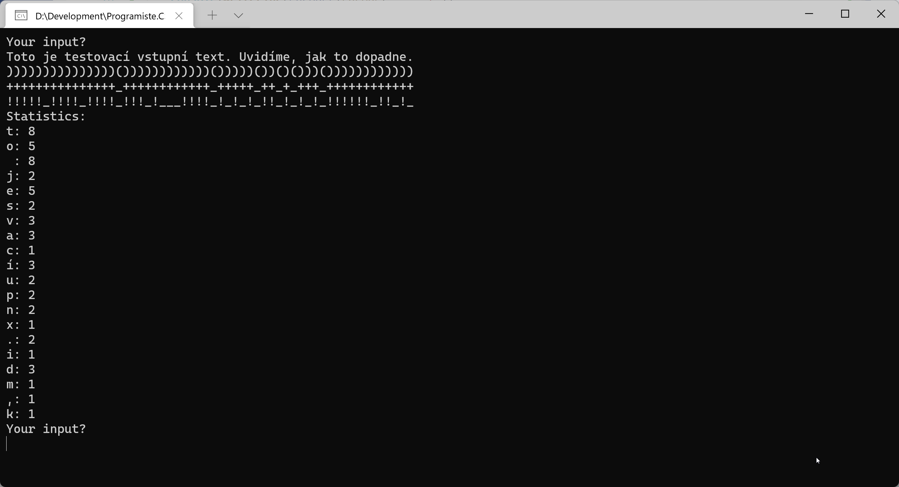

# Duplicate Encoder

Vytvořte miniaplikaci, která zpracuje vstupní text. Znaky, které se v něm opakují,
převede na jednu značku (např. `)`), ostatní na jinou značku (např. `(`).
Implementaci zapouzdřete do třídy a jako vedlejší produkt ji naučte i vypsat
statistiku četnosti znaků ve vstupním textu.



## Implementační instrukce (nezávazné)
1. Vytvořte třídu (`class DuplicateEncoder`), která bude mít konstruktor s jedním parametrem (vstupní text).
1. Konstruktor uloží vstupní text do privátního fieldu třídy a zároveň rovnou spočítá statistiku znaků v textu.
	Statistiku reprezentujte vhodnou datovou strukturou (např. `Dictionary<char, int>`) a uložte ji jako privátní field třídy.
1. Přidejte metodu `Encode`, která použije data z privátních fieldů a provede sestavení výstupního kódování.
1. Přidejte metodu `PrintStatistics`, která použije data třídy a vypíše statistiku četnosti znaků.

## Challenges
1. Udělejte kódování parametrizovatelné, např. nastavitelné znaky pro reprezentaci unikátního a duplicitního znaku,
2. nebo mez pro duplicitu (počet opakování znaku, od kterého se má považovat za signifikantně duplicitní).
3. Zamyslete se nad problémem: Pokud máme k dispozici statistiku (viz screenshot), jsme schopni z ní zpětně
  zrekonstruovat původní text? Za jakých podmínek je to možné?

## Inspirace
```csharp
while (true)
{
	Console.WriteLine("Your input?");
	var input = Console.ReadLine();
	
	var encoder = new DuplicateEncoder(input);
	Console.WriteLine(encoder.Encode());
	Console.WriteLine(encoder.Encode('_', '+'));
	Console.WriteLine(encoder.Encode('_', '!', 3));
	encoder.PrintStatistics();
}

public class DuplicateEncoder
{
	private string normalizedInput;
	private Dictionary<char, int> statistics;

	public DuplicateEncoder(string input)
	{
		this.normalizedInput = input.ToLower();
		BuildStatistics();
	}

	private void BuildStatistics()
	{
		statistics = new Dictionary<char, int>();
		foreach (var character in normalizedInput)
		{
			if (statistics.TryGetValue(character, out int count))
			{
				statistics[character] = count + 1;
			}
			else
			{
				statistics[character] = 1;
			}
		}
	}

	public string Encode(char uniqueSymbol = '(', char duplicateSymbol = ')', int duplicateThreshold = 2)
	{
		string encodedResult = null;
		foreach (var character in normalizedInput)
		{
			if (statistics.TryGetValue(character, out int count) && (count >= duplicateThreshold))
			{
				encodedResult = encodedResult + duplicateSymbol;
			}
			else
			{
				encodedResult = encodedResult + uniqueSymbol;
			}
		}
		return encodedResult;
	}

	public void PrintStatistics()
	{
		Console.WriteLine("Statistics:");
		foreach (var dictionaryItem in statistics)
		{
			Console.WriteLine($"{dictionaryItem.Key}: {dictionaryItem.Value}");
		}
	}
}
```


