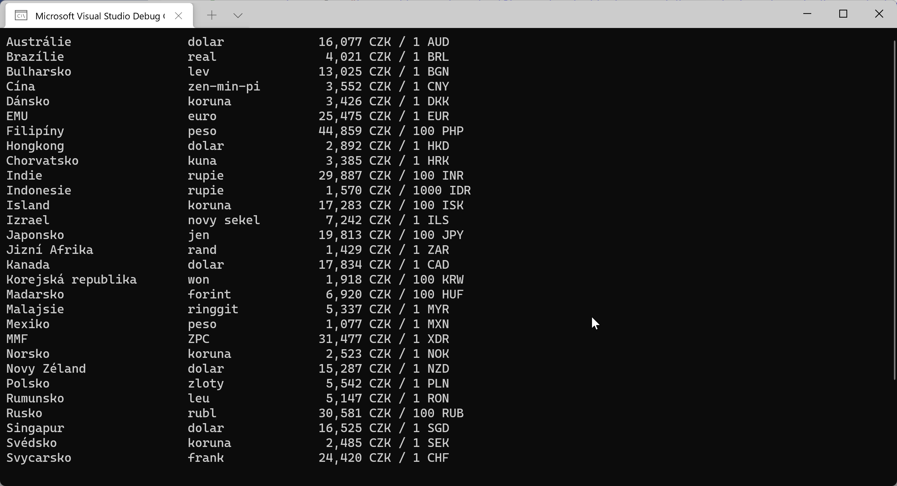

# Kurzovní lístek - zpracování textových dat

Česká národní banka publikuje oficiální kurzy měn pro každý den na svých webových stránkách: https://www.cnb.cz/cs/financni-trhy/devizovy-trh/kurzy-devizoveho-trhu/kurzy-devizoveho-trhu/

Pro snažší strojové zpracování publikuje vždy i strukturovanou textovou podobu: https://www.cnb.cz/cs/financni-trhy/devizovy-trh/kurzy-devizoveho-trhu/kurzy-devizoveho-trhu/denni_kurz.txt

Data vypadají zhruba takto (počet řádků zkrácen):
```
08.12.2021 #236
země|měna|množství|kód|kurz
Austrálie|dolar|1|AUD|16,077
Brazílie|real|1|BRL|4,021
Bulharsko|lev|1|BGN|13,025
Čína|žen-min-pi|1|CNY|3,552
Dánsko|koruna|1|DKK|3,426
EMU|euro|1|EUR|25,475
```

Napište miniaplikaci, která stáhne aktuální kurzovní lístek z webu ČNB a vypíše jej uživateli v této podobě:



## Bude se vám hodit

#### Získání obsahu webové stránky do string
```csharp
using var httpClient = new HttpClient();
string pageContent = await httpClient.GetStringAsync(url);
```
`HttpClient` je třída, která nám umožňuje komunikovat s HTTP servery.

`using` zajišťuje řádný úklid, když už není HttpClient potřeba, např. aby nezůstalo otevřené spojení na server, atp.

`await` se používá při volání tzv. asynchronních operací, abychom neblokovali procesor, když čekáme na výsledek nějaké I/O akce.


## Challenge 1
Webu ČNB lze předat požadované datum, z kterého kurzovní lístek chceme: https://www.cnb.cz/cs/financni-trhy/devizovy-trh/kurzy-devizoveho-trhu/kurzy-devizoveho-trhu/denni_kurz.txt?date=07.12.2021

Vylepšete aplikaci tak, že do výstupu přidá informaci, jak se kurz změnil oproti hodnotě z předchozího dne (třeba v procentech).

## Challenge 2
Vypište tabulku, kde v řádcích i sloupcích budou jednotlivé měny a v příslušné buňce bude jejich vzájemný kurz, např. 1 EUR = 1,17 USD.

Příklady výstupů: https://www.google.com/search?q=exchange+rates+cross+table&tbm=isch

## Inspirace
```csharp
const string url = "https://www.cnb.cz/cs/financni-trhy/devizovy-trh/kurzy-devizoveho-trhu/kurzy-devizoveho-trhu/denni_kurz.txt";

using var httpClient = new HttpClient();
string cnbWebContent = await httpClient.GetStringAsync(url);

var lines = cnbWebContent.Split('\n');
for (int i = 2; i < lines.Length; i++)
{
	var line = lines[i];
	if (!line.Contains("|"))
	{
		continue;
	}

	var segments = line.Split('|');

	var country = segments[0];
	var currencyName = segments[1];
	var amount = Convert.ToDecimal(segments[2]);
	var currencyCode = segments[3];
	var exchangeRate = Convert.ToDecimal(segments[4]);

	Console.Write(country.PadRight(25));
	Console.Write(currencyName.PadRight(15));
	Console.Write(String.Format("{0:n2} ", exchangeRate).PadLeft(10));
	Console.Write($"CZK / {amount} {currencyCode}");
	Console.WriteLine();
}
```