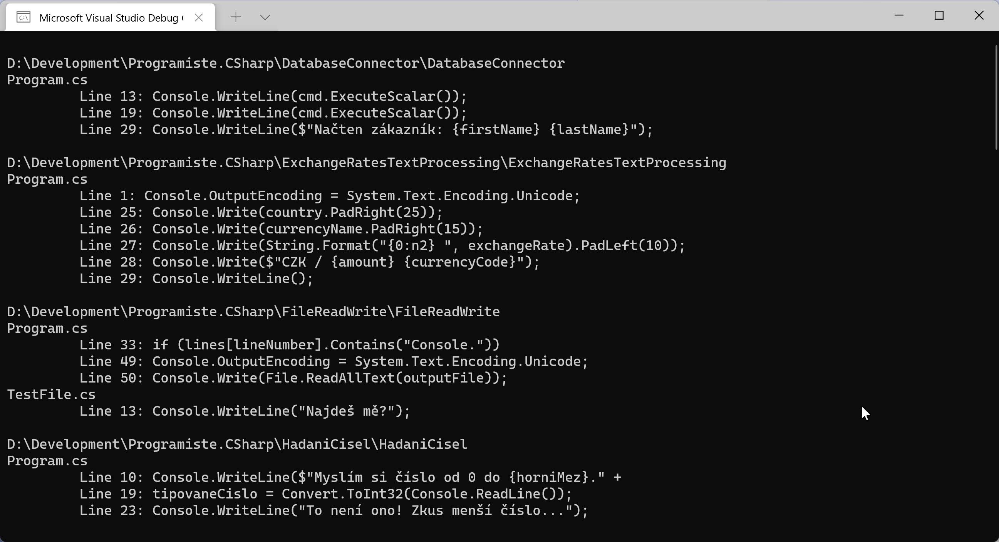

# Vyhledávání souborů

Napište konzolovou miniaplikaci, která projde zvolenou složku a její podsložky, najde v nich C# soubory (s příponou `.cs`) a vypíše z nich řádky, které pracují s třídou `Console` (pro zjednodušení - obsahují text "`Console.`").

Výstup zapište do souboru `output.txt` a na konci programu obsah výsledného souboru vypište na obrazovku.

## Příklad


## Bude se vám hodit
* třída `System.IO.Directory` - https://docs.microsoft.com/en-us/dotnet/api/system.io.directory
* `System.IO.File` - https://docs.microsoft.com/en-us/dotnet/api/system.io.file
* `System.IO.Path` - https://docs.microsoft.com/en-us/dotnet/api/system.io.path

## Challenges pro pokročilejší
1. Optimalizujte kód, aby pracoval efektivně se soubory (prozkoumejte možnosti `FileStream`)
1. Optimalizujte kód, aby pracoval efektivně s textovými řetězci (prozkoumejte možnosti třídy `StringBuilder`)
1. Umožněte prohledávat více typů souborů najednou, např. `.cs` a `.md`.
1. Umožněte prohledávání celého disku. Bude potřeba se vypořádat např. s nepřístupnými systémovými složkami (přeskočit) a podobnými záludnostmi.

## Inspirace
Příklad kódu bez optimalizací
```csharp
using System;
using System.IO;

var outputFile = "output.txt";
if (File.Exists(outputFile))
{
	File.Delete(outputFile);
}

var searchDirectory = "D:\\Development\\Programiste.CSharp";

var files = Directory.EnumerateFiles(searchDirectory, "*.cs", SearchOption.AllDirectories);
string directory = null;

foreach (var fileName in files)
{
	var fileExtension = Path.GetExtension(fileName);

	if (Path.GetDirectoryName(fileName) != directory)
	{
		directory = Path.GetDirectoryName(fileName);
		File.AppendAllText(outputFile, Environment.NewLine + directory + Environment.NewLine);
	}

	if (fileExtension == ".cs")
	{
		var fileContents = File.ReadAllText(fileName);
		var fileOutput = String.Empty;
		var lines = fileContents.Split(Environment.NewLine);

		for (int lineNumber = 0; lineNumber < lines.Length; lineNumber++)
		{
			if (lines[lineNumber].Contains("Console."))
			{
				fileOutput += $"\t Line {lineNumber + 1}: {lines[lineNumber].Trim()}" + Environment.NewLine;
			}
		}

		if (!String.IsNullOrWhiteSpace(fileOutput))
		{
			File.AppendAllText(outputFile, Path.GetFileName(fileName) + Environment.NewLine);
			File.AppendAllText(outputFile, fileOutput);
		}


	}
}

Console.OutputEncoding = System.Text.Encoding.Unicode;
Console.Write(File.ReadAllText(outputFile));
```

