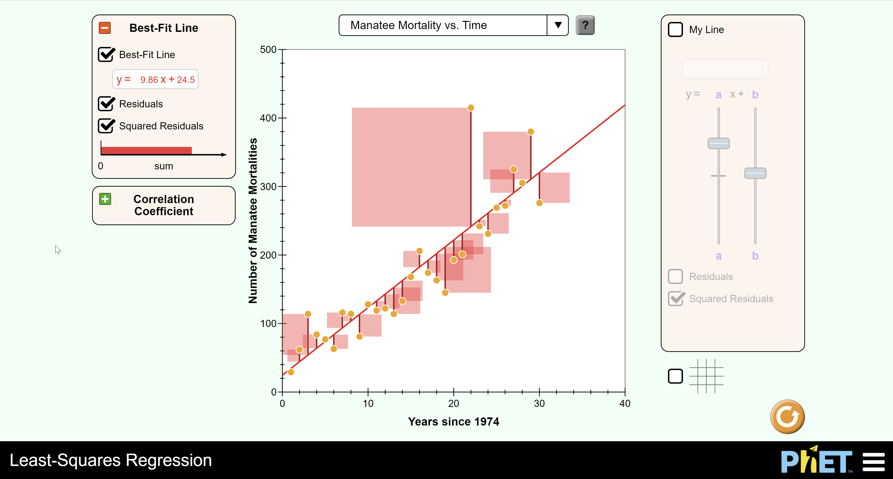

# Regresní přímka metodou nejmenších čtverců
(LSRL - Least Squares Regression Line)

## Úvod

AI. Umělá inteligence. Machine Learning. Jak fungují? Postupně se pokusíme na jednoduchých příkladech vyzkoušet, co stojí za umělou inteligencí, jak funguje.
Dnes začneme úplným základem - predikcí hodnot na základě regresní analýzy.

### Regresní analýza
**Regresní analýza** hledá funkci, která co nejlépe popisuje vztah mezi proměnnými (pro jednoduchost pracujme se dvěma proměnnými).
Představ si graf s body, kde na ose x je nezávislá proměnná (např. věk auta) a na ose y je závislá proměnná (např. cena auta).
Hledáme jakoukoli funkci (může to být přímka, parabola, křivka nebo složitější tvar), která co nejlépe prochází těmito body.
Tato funkce nám pak umožňuje **předpovědět** cenu auta na základě jeho věku. Tímto způsobem se snažíme najít nejlepší možný
vztah mezi proměnnými, aby naše předpovědi byly co nejpřesnější.

**Lineární regresní analýza** je jednoduchý příklad regresní analýzy, kde se snažíme najít nejlepší
přímku, která popisuje vztah mezi dvěma proměnnými. Představ si graf s body, kde na ose x je
nezávislá proměnná (např. počet pokojů v domě) a na ose y je závislá proměnná (např. cena domu).
Lineární regrese hledá takovou přímku, která co nejlépe prochází těmito body, a výsledná přímka
nám umožňuje předpovědět cenu domu na základě počtu pokojů.

### Metoda nejmenších čtverců
Metoda nejmenších čtverců (least squares method) je základní technika používaná při lineární
regresní analýze, jejímž cílem je najít nejlepší přímku, která popisuje vztah mezi dvěma proměnnými.
Tato metoda funguje tak, že minimalizuje součet čtverců rozdílů mezi skutečnými hodnotami
závislé proměnné (např. cena domu) a hodnotami předpovězenými lineární funkcí (přímka na grafu).

Při použití metody nejmenších čtverců se snažíme najít koeficienty lineární funkce
(`y = ax + b`), které minimalizují součet čtverců těchto rozdílů. Když nalezneme tyto koeficienty,
získáme lineární funkci, která nejlépe prochází našimi daty, a můžeme ji použít k předpovídání
hodnot závislé proměnné na základě hodnot nezávislé proměnné.

Metoda nejmenších čtverců je široce používána pro odhad vztahů mezi proměnnými v různých oborech,
jako jsou ekonomie, biologie nebo sociální vědy.

Modelaci si můžete vyzkoušet zde: https://phet.colorado.edu/sims/html/least-squares-regression/latest/least-squares-regression_all.html

# Úloha

1. Prozkoumej metodu nejmenších čtverců a její princip.
2. Vytvoř jednoduchý program v C#, který pomocí této metody předpoví hodnoty, které dosud neznáme.
	* vstupem programu (Console nebo soubor) bude
		* učící sada dvojic `[x, y]`
		* dotazovací sada hodnot `x`
	* výstupem programu bude
		* predikce hodnot `y` pro dotazovací sadu `x`

(Good to know: Existuje vzorec pro výpočet hledaných koeficientů. Zvládneš ho najít a aplikovat[?](http://physics.ujep.cz/~ehejnova/UTM/materialy_studium/linearni_regrese.pdf))

# Inspirace
Jedno z možných řešení nalezneš jako obvykle v tomto repozitáři.