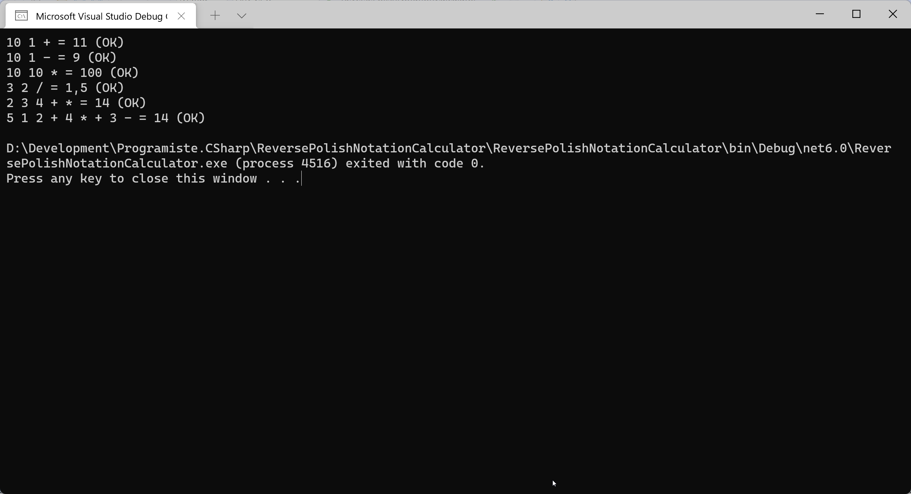

# Kalkulačka s reverzní polskou notací (postfixová notace)

[RPN](https://cs.wikipedia.org/wiki/Postfixov%C3%A1_notace) je způsob zápisu matematického výrazu, kde operátor následuje své operandy, přičemž je odstraněna nutnost používat závorky (priorita operátorů se vyjadřuje samotným zápisem výrazu).

Běžné operátory jsou binární, tj. mají dva operandy. Lze tedy říct, že kdykoliv narazíme na operátor, předchozí dvě hodnoty jsou jeho operandy.

Jednotlivé složky (tokeny) oddělujme mezerníkem.

Např.
* `3 4 +` odpovídá výrazu `3 + 4`.
* `2 3 4 + *` odpovídá výrazu `(3 + 4) * 2`
* `5 1 2 + 4 * + 3 -` odpovídá výrazu `5 + ((1 + 2) * 4) - 3`

## Úloha
Napište miniaplikaci, která bude přijímat výraz zapsaný reverzní polskou notací a vypočte numerický výsledek.



## Inspirace
```csharp
Test("10 1 +", 11);
Test("10 1 -", 9);
Test("10 10 *", 100);
Test("3 2 /", 1.5);
Test("2 3 4 + *", 14);
Test("5 1 2 + 4 * + 3 -", 14);

void Test(string expression, double expectedResult)
{
	var actualResult = Calculate(expression);
	Console.Write($"{expression} = {actualResult}");
	if (actualResult == expectedResult)
	{
		Console.WriteLine(" (OK)");
	}
	else
	{
		Console.WriteLine(" (FAIL)");
	}
}

double Calculate(string expression)
{
	var stack = new Stack<double>();

	var tokens = expression.Split(' ');
	double operand1, operand2;
	foreach (string token in tokens)
	{
		switch (token)
		{
			case "+":
				operand1 = stack.Pop();
				operand2 = stack.Pop();
				stack.Push(operand1 + operand2);
				break;
			case "-":
				operand1 = stack.Pop();
				operand2 = stack.Pop();
				stack.Push(operand2 - operand1);
				break;
			case "*":
				operand1 = stack.Pop();
				operand2 = stack.Pop();
				stack.Push(operand1 * operand2);
				break;
			case "/":
				operand1 = stack.Pop();
				operand2 = stack.Pop();
				stack.Push(operand2 / operand1);
				break;
			default:
				stack.Push(double.Parse(token));
				break;
		}
	}
	return stack.Pop();
}
```


