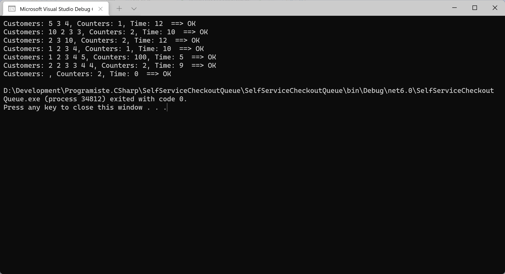

# Fronta u samoobslužných pokladen

Máme supermarket a v něm samoobslužné podkladny. Známe počet pokladen, všechny fungují stejně. K pokladnám vede jediná společná fronta zákazníků a u každého zákazníka víme, kolik času bude u pokladny potřebovat k odbavení svého nákupu.

Sestavte aplikaci, která bude počítat, za jak dlouho bude odbaven poslední zákazník.

Zákazníci (potřebné časy) | Počet pokladen | Potřebná doba
------------------------------|-----------------|----------------
5, 3, 4 | 1 | 12
10, 2, 3, 3 | 2 | 10
2, 3, 10 | 2 | 12
1, 2, 3, 4 | 1 | 10
1, 2, 3, 4, 5 | 100 | 5
2, 2, 3, 3, 4, 4 | 2 | 9
žádný | 2 | 0



Na vstupu předpokládejte:
* potřebné časy jednotlivých zákazníků, např. ve formě pole `int[]`
* počet pokladen - `int`

## Implementační typy
* prozkoumejte datovou strukturu typu FIFO (First-In, First-Out), může se vám hodit
* s výhodou lze využít uspořádání problému do tříd, kdy každá třída řeší svojí část problému
* alternativně lze využít několika prostých polí

## Challenges
* Upravte uspořádání, aby bylo možné v průběhu času zákazníky do fronty přidávat (např. "po deseti jednotkách času přijde do fronty další zákazník, který potřebuje na odbavení u pokladny 7 jednotek času)

## Inspirace
```csharp
Test(new int[] { 5, 3, 4 }, 1, 12);
Test(new int[] { 10, 2, 3, 3 }, 2, 10);
Test(new int[] { 2, 3, 10 }, 2, 12);
Test(new int[] { 1, 2, 3, 4 }, 1, 10);
Test(new int[] { 1, 2, 3, 4, 5 }, 100, 5);
Test(new int[] { 2, 2, 3, 3, 4, 4 }, 2, 9);
Test(new int[0], 2, 0); // empty queue

void Test(int[] customersProcessingTimes, int selfserviceCountersCount, int expectedTimeToVerify)
{
	var supermarket = new Supermarket(selfserviceCountersCount);
	var computedTime = supermarket.ProcessCustomers(customersProcessingTimes);

	Console.Write($"Customers: {customersProcessingTimes}, Counters: {selfserviceCountersCount}, Time: {computedTime}");
	if (computedTime == expectedTimeToVerify)
	{
		Console.WriteLine("  ==> OK");
	}
	else
	{
		Console.WriteLine("  ==> FAILED");
	}
}

public class Supermarket
{
	private Queue<Customer> customersQueue;
	private List<SelfserviceCounter> selfserviceCountersList;
	private int timer = 0;

	public Supermarket(int selfserviceCountersCount)
	{
		// create counters
		selfserviceCountersList = new List<SelfserviceCounter>();
		for (int i = 0; i < selfserviceCountersCount; i++)
		{
			selfserviceCountersList.Add(new SelfserviceCounter());
		}
	}

	public int ProcessCustomers(int[] customersProcessingTimes)
	{
		customersQueue = new Queue<Customer>();
		foreach (var customerTime in customersProcessingTimes)
		{
			customersQueue.Enqueue(new Customer(customerTime));
		}
		timer = 0;

		while (true)
		{
			if (customersQueue.Count == 0)
			{
				bool allCountersFree = true;
				foreach (var counter in selfserviceCountersList)
				{
					if (!counter.IsFree())
					{
						allCountersFree = false;
						break; // occupied counter found, exit foreach loop
					}
				}
				if (allCountersFree)
				{
					break; // work done, exit main while loop
				}
			}

			TimerTick();
		}
		return timer;
	}

	private void TimerTick()
	{
		foreach (var selfserviceCounter in selfserviceCountersList)
		{
			if (selfserviceCounter.IsFree())
			{
				if (customersQueue.TryDequeue(out var customer))
				{
					selfserviceCounter.AssignCustomer(customer);
				}
			}
			selfserviceCounter.TimerTick();
		}
		timer++;
	}
}

public class SelfserviceCounter
{
	private int timeToFinishCurrentCustomer;
	private Customer currentCustomer;

	public void TimerTick()
	{
		if (timeToFinishCurrentCustomer > 0)
		{
			timeToFinishCurrentCustomer--;

			// current customer completed?
			if (timeToFinishCurrentCustomer == 0)
			{
				currentCustomer = null;
			}
		}
	}

	public bool IsFree()
	{
		return (currentCustomer == null);
	}

	public void AssignCustomer(Customer customer)
	{
		if (currentCustomer != null)
		{
			throw new InvalidOperationException("Counter is occupied!");
		}

		currentCustomer = customer;
		timeToFinishCurrentCustomer = customer.ProcessingTimeNeeded;
	}
}

public class Customer
{
	public Customer(int processingTimeNeeded)
	{
		ProcessingTimeNeeded = processingTimeNeeded;
	}

	public int ProcessingTimeNeeded { get; init; }
}
```

---
Original kata: https://www.codewars.com/kata/57b06f90e298a7b53d000a86

