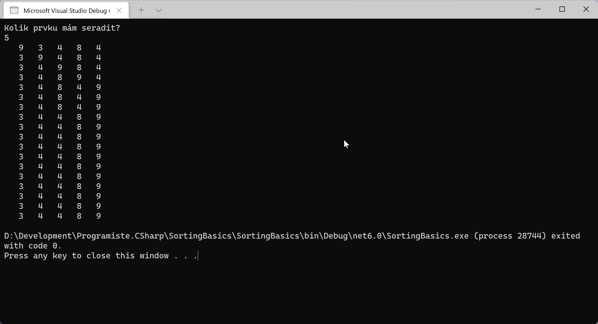

# Základní řazení (ordering, sorting)

*Řazení* je úloha, kdy je cílem vytvořit uspořádanou posloupnost prvků. (Doporučuji nezaměňovat s pojmem *třídění*, který se používá pro kategorizaci prvků do určitých skupin dle podobných vlastností.)

Dnešním úkolem bude prozkoumat situaci kolem základních algoritmů řazení a jeden z nich (dle vlastního výběru) implementovat.

Snažte se najít odpověď na otázky:
1. Jaký je rozdíl mezi *stabilním* a *nestabilním* řazením?	Kdy této vlastnosti můžete využít?
2. Co znamená, když je řadící algoritmus označovaný jako *přirozený*? Kdy této vlastnosti můžete využít?
3. Jak fungují základní běžné algoritmy?
    * insertion-sort (řazení vkládáním)
    * selection-sort (řazení výběrem)
	* bouble-sort (bublikové řazení)
    * VOLITELNĚ: quick-sort (rychlé řazení)
4. Proč jsou některé algoritmy řádově rychlejší než ostatní?

### Doporučené zdroje:
* [Wikipedia: Řadící algoritmus](https://cs.wikipedia.org/wiki/%C5%98adic%C3%AD_algoritmus)
* [Wikipedia: Řazení výběrem](https://cs.wikipedia.org/wiki/%C5%98azen%C3%AD_v%C3%BDb%C4%9Brem)
* [Wikipedia: Řazení vkládáním](https://cs.wikipedia.org/wiki/%C5%98azen%C3%AD_vkl%C3%A1d%C3%A1n%C3%ADm)
* [Wikipedia: Bublinkové řazení](https://cs.wikipedia.org/wiki/Bublinkov%C3%A9_%C5%99azen%C3%AD)
* [Algoritmy.net - Bouble sort](https://www.algoritmy.net/article/3/Bubble-sort)
* [Algoritmy.net - Selection sort](https://www.algoritmy.net/article/4/Selection-sort)
* [Algoritmy.net - Insertion sort](https://www.algoritmy.net/article/8/Insertion-sort)
* ([Algoritmy.net - Quick sort](https://www.algoritmy.net/article/10/Quicksort))
* [Algoritmy.net - Porovnání řadících algoritmů](https://www.algoritmy.net/article/75/Porovnani-algoritmu)

## Úkol
Napište jednoduchou miniaplikaci v C#, která si vygeneruje pole náhodných prvků zadané velikosti a ty následně seřadí. Implementujte klidně dle vlastní fantazie, na konci se však podívejte, jestli vaše implementace odpovídá některému z běžných řadících algoritmů.



### Challenges
1. Zkuste dle výpisu průběhu algoritmu najít možné optimalizace algoritmu. Nešlo by řazení ukončit dříve? Nějaké jiné zkratky?
1. Implementujte více řadících algoritmů. Porovnejte jejich rychlost nad stejnou vstupní množinou.
1. Prozkoumejte a implementujte QuickSort. Proč je řádově rychlejší než základní algoritmy zmiňované výše?

## Inspirace
```csharp
Console.WriteLine("Kolik prvků mám seřadit?");
int size = Convert.ToInt32(Console.ReadLine());

// generate input data
int[] inputData = new int[size];
for (int i = 0; i < size; i++)
{
	inputData[i] = Random.Shared.Next(size * 2);
}

PrintArray(inputData);

BoubleSort(inputData);

PrintArray(inputData);


void BoubleSort(int[] data)
{
	int temp;
	for (int j = 0; j <= data.Length - 2; j++)
	{
		for (int i = 0; i <= data.Length - 2; i++)
		{
			if (data[i] > data[i + 1])
			{
				temp = data[i + 1];
				data[i + 1] = data[i];
				data[i] = temp;
			}
			PrintArray(data);
		}
	}
}


void PrintArray(int[] inputData)
{
	for (int i = 0; i < inputData.Length; i++)
	{
		Console.Write($"{inputData[i]}".PadLeft(4));
	}
	Console.WriteLine();
}
```