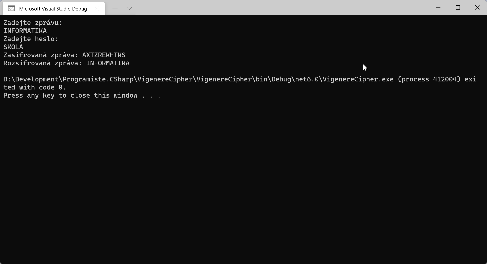
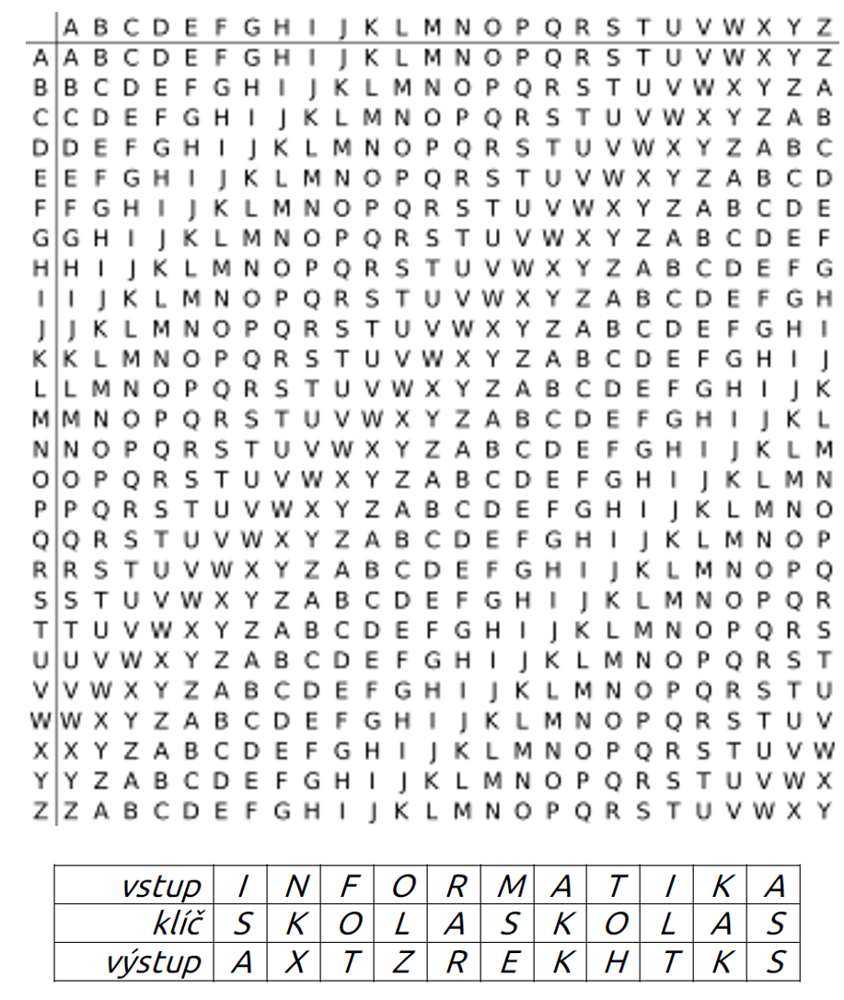

# Vigenerova šifra

## Zadání
Vytvořte jednoduchou miniaplikaci v C#, která bude umět šifrovat a dešifrovat zadané zprávy textové zprávy pomocí [Vigenerova šifrovacího algoritmu](https://cs.wikipedia.org/wiki/Vigen%C3%A8rova_%C5%A1ifra).



## Vigenerova šifra ve zkratce
VŠ je založena na posunu písmen v abecedě.
1. Heslo `a` (první písmeno abecedy) znaky nikam neposouvá.
1. Pokud by bylo heslo `b` (druhé písmeno abecedy), posunu každý znak vstupu o jedno písmeno, např. z písmene `e` by se stalo písmeno `f`. Poslední písmeno `z` by se cyklicky změnilo na `a`. Ze vstupu `ahoj` by se stalo `bipk`.
1. Pokud by bylo heslo `c` (třetí písmeno abecedy), posunu každý znak vstupu o tolik písmen, kolik znaků je heslo vzdáleno od základního písmene `a`, tedy o dva znaky. Ze vstupu `ahoj` by se stalo `cjql`.
1. Pokud má heslo více znaků, každý znak hesla použiju postupně pro jedno písmeno vstupního řetězce. Např. šifruji slovo `wikipedie` s heslem `bagr`, tak `w` posouvám o 1 znak (vzdálenost `b` od `a`), písmeno `i` neposouvám (druhým písmenem v `bagr` je `a`), písmeno `k` posouvám o 6 znaků (vzdálenost `g` od `a`). Když je vstupní řetězec delší než heslo, vracím se v hesle na začátek a používám ho stále dokola. Jako kdyby heslo bylo `bagrbagrbagrbagr...`.
1. Ručně se šifra řeší obvykle prostřednictvím tzv. Vigenerova čtverce. Příklad pro slovo `informatika` a heslo `skola`:


## Bude se vám hodit
Získání znaku z konkrétní pozice textového řetězce (zero-based indexing):
```csharp
var znak = test[pozice];
```
Získání číselného [ASCII kódu](https://en.wikipedia.org/wiki/ASCII) znaku:
```csharp
int kod = (int)znak;
int kod2 = (int)'A'; // 65
```
Získání vzdálenosti dvou písmen v abecedě:
```csharp
int posun = znak1 - znak2;
int posun2 = 'C' - 'A'; // 2
```
Převod čísla na znak (z jeho [ASCII kódu](https://en.wikipedia.org/wiki/ASCII))
```csharp
char pismeno = (char)asciiKod;
char pismeno2 = (char)65; // A
```
Převod textového řetězce na pole znaků a zpět:
```csharp
char[] pole = retezec.ToCharArray(); // z textu na pole znaků
string vystup = new string(pole);    // z pole znaků na text
```

## Inspirace
```csharp
string heslo = "SKOLA";
string vstup = "INFORMATIKA";
		
Console.WriteLine(Vigenere(vstup, heslo, true));	// false = decrypt
	
string Vigenere(string vstup, string heslo, bool encrypt)
{
	char[] vystup = new char[vstup.Length];
		
	for (int i = 0; i < vstup.Length; i++)
	{
		int posun = heslo[i % heslo.Length] - 'A';
			
		if (!encrypt)
		{
			posun = -posun;
		}
			
		int znak = (vstup[i] - 'A' + posun) % 26;
			
		if (znak < 0) // decrypt
		{
			znak = znak + 26;
		}
			
		vystup[i] = (char)('A' + znak);
	}
	return new string(vystup);
}
```